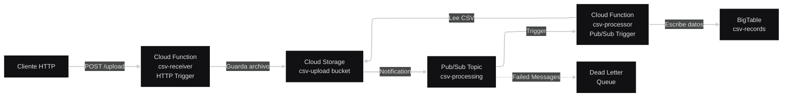
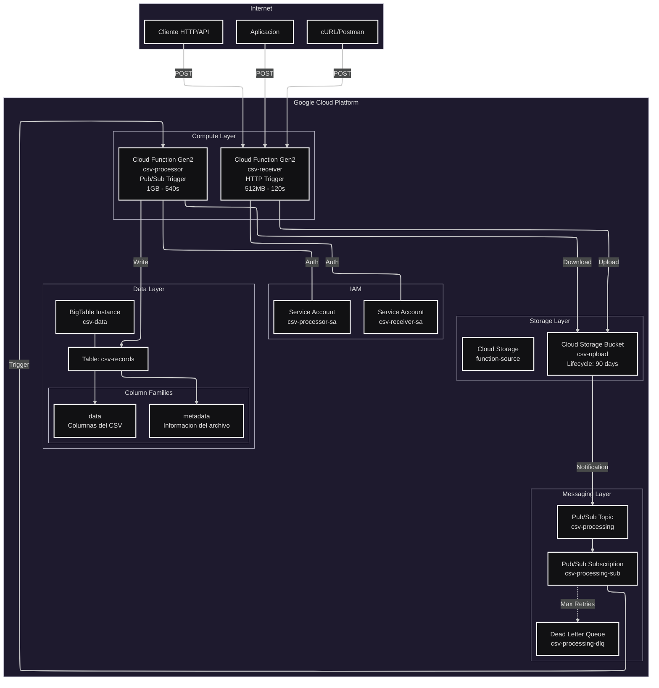
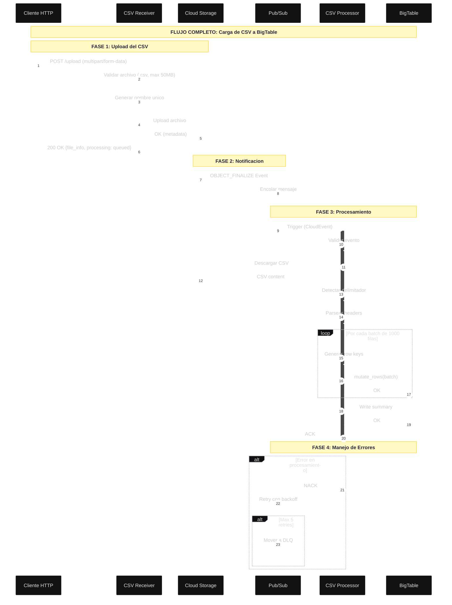
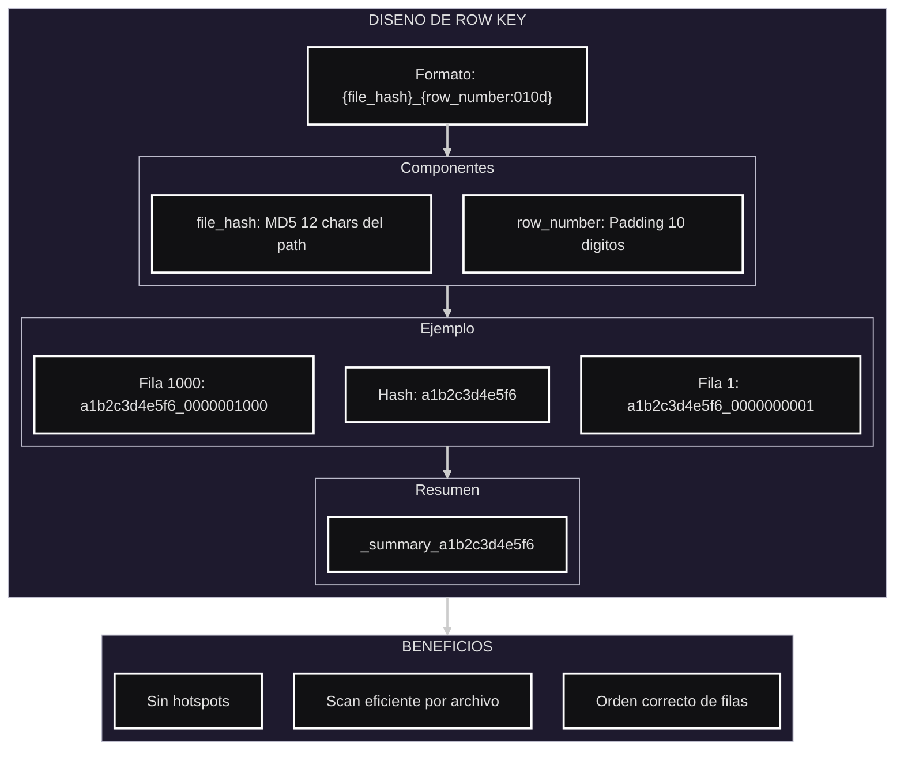
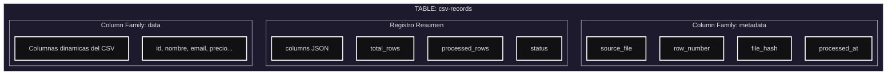

# Sistema de Carga de CSV a BigTable via API

Sistema serverless para cargar archivos CSV a BigTable mediante una API HTTP en Google Cloud Platform utilizando Cloud Functions Gen2, Pub/Sub y Cloud Storage.

---

## Tabla de Contenidos

- [Descripción](#descripción)
- [Arquitectura](#arquitectura)
- [Características](#características)
- [Tecnologías](#tecnologías)
- [Requisitos Previos](#requisitos-previos)
- [Estructura del Proyecto](#estructura-del-proyecto)
- [Instalación](#instalación)
- [Configuración](#configuración)
- [Uso](#uso)
- [Testing](#testing)
- [Monitoreo](#monitoreo)
- [Troubleshooting](#troubleshooting)
- [Licencia](#licencia)

---

## Descripción

Este proyecto implementa una solución serverless en Google Cloud Platform para:

- Recibir archivos CSV via API HTTP REST
- Almacenar CSVs en Cloud Storage con organización por fecha
- Procesar automáticamente el contenido del CSV
- Detectar delimitadores y columnas dinámicamente
- Cargar todos los datos a BigTable en batches
- Generar resúmenes automáticos del procesamiento
- Escalar automáticamente según la demanda

### Caso de Uso

Ideal para organizaciones que necesitan:

- **Ingesta de datos**: Cargar datos desde sistemas externos via API
- **ETL Serverless**: Transformar CSV a NoSQL sin gestionar servidores
- **Data Lake**: Almacenar y procesar archivos CSV de forma automática
- **Integración**: API REST para cualquier cliente (web, mobile, sistemas legacy)
- **Procesamiento batch**: Cargar grandes volúmenes de datos de forma eficiente
- **Auditoría**: Trazabilidad completa de archivos procesados

---

## Arquitectura

### Diagrama de Arquitectura General



### Diagrama de Componentes Detallado



### Diagrama de Secuencia - Flujo Completo



### Diseño de Row Key - BigTable



### Esquema de Column Families



---

## Características

### Funcionalidades Principales

| Característica | Descripción |
|----------------|-------------|
| **API REST HTTP** | Endpoint público para subir CSVs via POST |
| **Múltiples formatos** | Soporta multipart/form-data, application/json, text/csv |
| **Detección automática** | Detecta delimitador automáticamente (, ; \t \|) |
| **Columnas dinámicas** | Procesa cualquier estructura de CSV |
| **Sanitización** | Limpia nombres de columnas para BigTable |
| **Procesamiento batch** | 1000 filas por batch para eficiencia |
| **Resumen automático** | Guarda estadísticas del procesamiento |
| **Retry automático** | Pub/Sub con backoff exponencial |
| **Dead Letter Queue** | Mensajes fallidos preservados |

### Características Técnicas

| Característica | Detalles |
|----------------|----------|
| **Infraestructura** | 100% Terraform (IaC) |
| **Serverless** | Sin gestión de servidores |
| **Escalabilidad** | Automática de 0-10 instancias |
| **Máx. tamaño archivo** | 50 MB |
| **Máx. filas por CSV** | 1,000,000 |
| **Batch size** | 1,000 filas |
| **Timeout receiver** | 120 segundos |
| **Timeout processor** | 540 segundos (9 minutos) |
| **Memoria processor** | 1 GB (configurable) |
| **Retry attempts** | 5 intentos |
| **Backoff** | 10s - 600s exponencial |

### Formatos de Entrada Soportados

| Formato | Content-Type | Ejemplo |
|---------|--------------|---------|
| **Multipart** | multipart/form-data | `curl -F "file=@data.csv"` |
| **JSON** | application/json | `{"filename": "x.csv", "data": "..."}` |
| **Raw CSV** | text/csv | `curl -d @data.csv` |

---

## Tecnologías

| Componente | Tecnología |
|------------|------------|
| **IaC** | Terraform >= 1.0 |
| **API HTTP** | Cloud Functions Gen2 |
| **Processor** | Cloud Functions Gen2 |
| **Runtime** | Python 3.11 |
| **Messaging** | Pub/Sub |
| **Database** | BigTable |
| **Storage** | Cloud Storage |
| **Framework** | Flask + Functions Framework |
| **Observability** | Cloud Logging, Cloud Monitoring |

---

## Requisitos Previos

### Software Requerido

```bash
# Terraform >= 1.0
terraform --version

# Google Cloud SDK
gcloud --version

# Make (recomendado)
make --version

# cbt - BigTable CLI (opcional)
cbt version

# curl y jq (para testing)
curl --version
jq --version
```

### Permisos GCP Necesarios

```yaml
roles:
  - roles/owner                              # O roles específicos:
  - roles/resourcemanager.projectIamAdmin
  - roles/iam.serviceAccountAdmin
  - roles/cloudfunctions.admin
  - roles/storage.admin
  - roles/pubsub.admin
  - roles/bigtable.admin
  - roles/artifactregistry.admin
  - roles/cloudbuild.builds.editor
  - roles/eventarc.admin
  - roles/run.admin
```

### Configuración Inicial de GCP

```bash
# Autenticar con GCP
gcloud auth login
gcloud auth application-default login

# Configurar proyecto
gcloud config set project TU_PROYECTO_ID

# Verificar billing habilitado
gcloud beta billing accounts list
```

---

## Estructura del Proyecto

```
gcp-csv-to-bigtable/
├── main.tf                          # Infraestructura Terraform principal
├── variables.tf                     # Variables configurables
├── outputs.tf                       # Outputs de Terraform
├── terraform.tfvars                 # Valores de variables
├── Makefile                         # Comandos de automatización
├── README.md                        # Esta documentación
│
├── cloud-functions/
│   ├── csv-receiver/                # Función HTTP (recibe CSV)
│   │   ├── main.py
│   │   └── requirements.txt
│   └── csv-processor/               # Función Pub/Sub (procesa CSV)
│       ├── main.py
│       └── requirements.txt
│
├── scripts/
   └── test_system.sh                # Pruebas end-to-end
```

---

## Instalación

### Opción 1: Usando Make (Recomendado)

```bash
# Clonar o descargar el proyecto
cd gcp-csv-to-bigtable

# Ver comandos disponibles
make help

# Configurar project_id
nano terraform.tfvars

# Inicializar y desplegar
make init
make plan
make apply

# Obtener URL de la API
make api-url
```

### Opción 2: Usando Terraform Directamente

```bash
# Inicializar Terraform
terraform init

# Ver plan de cambios
terraform plan \
  -var="project_id=TU_PROYECTO" \
  -var="region=us-central1" \
  -var="environment=dev"

# Aplicar infraestructura
terraform apply \
  -var="project_id=TU_PROYECTO" \
  -var="region=us-central1" \
  -var="environment=dev"

# Obtener URL de la API
terraform output api_url
```

### Opción 3: Despliegue Manual (gcloud)

```bash
# 1. Habilitar APIs
gcloud services enable \
  storage.googleapis.com \
  pubsub.googleapis.com \
  cloudfunctions.googleapis.com \
  bigtable.googleapis.com \
  bigtableadmin.googleapis.com \
  run.googleapis.com \
  eventarc.googleapis.com

# 2. Crear Service Accounts
gcloud iam service-accounts create csv-receiver-sa
gcloud iam service-accounts create csv-processor-sa

# 3. Crear Bucket
gsutil mb -l us-central1 gs://${PROJECT_ID}-csv-upload-dev

# 4. Crear Pub/Sub Topic
gcloud pubsub topics create csv-processing-dev

# 5. Crear BigTable
gcloud bigtable instances create csv-data-dev \
  --cluster-config=id=csv-data-dev-cluster,zone=us-central1-c,nodes=1

# 6. Crear tabla
cbt createtable csv-records
cbt createfamily csv-records data
cbt createfamily csv-records metadata

# 7. Deploy Receiver (HTTP)
gcloud functions deploy csv-receiver-dev \
  --gen2 --runtime=python311 --region=us-central1 \
  --source=./cloud-functions/csv-receiver \
  --entry-point=upload_csv \
  --trigger-http --allow-unauthenticated

# 8. Deploy Processor (Pub/Sub)
gcloud functions deploy csv-processor-dev \
  --gen2 --runtime=python311 --region=us-central1 \
  --source=./cloud-functions/csv-processor \
  --entry-point=process_csv \
  --trigger-topic=csv-processing-dev
```

---

## Configuración

### Variables Principales (terraform.tfvars)

```hcl
# REQUERIDO: Cambiar por tu Project ID
project_id = "tu-proyecto-gcp"

# Configuración General
region      = "us-central1"
zone        = "us-central1-c"
environment = "dev"

# BigTable
bigtable_num_nodes           = 1        # 1 para dev, 3+ para prod
bigtable_storage_type        = "SSD"
bigtable_deletion_protection = false    # true para prod
bigtable_retention_days      = 90

# Cloud Functions
function_max_instances = 10
function_min_instances = 0
processor_memory       = "1Gi"
processor_timeout      = 540

# Labels
labels = {
  managed_by  = "terraform"
  environment = "dev"
  purpose     = "csv-to-bigtable"
}
```

### Configuraciones por Ambiente

| Variable | Dev | Staging | Prod |
|----------|-----|---------|------|
| `bigtable_num_nodes` | 1 | 1 | 3+ |
| `bigtable_deletion_protection` | false | false | true |
| `function_min_instances` | 0 | 0 | 1 |
| `function_max_instances` | 10 | 50 | 100 |
| `processor_memory` | 1Gi | 2Gi | 4Gi |

---

## Uso

### Comandos Principales (Makefile)

```bash
# Ver todos los comandos
make help

# INFRAESTRUCTURA
make init           # Inicializar Terraform
make plan           # Ver plan de cambios
make apply          # Aplicar infraestructura
make destroy        # Destruir infraestructura

# PRUEBAS
make test           # Pruebas completas
make test-upload    # Subir CSV via API
make test-gsutil    # Subir CSV via gsutil
make test-verify    # Verificar en BigTable
make create-sample  # Crear CSV de ejemplo

# MONITOREO
make logs-receiver  # Logs del receiver
make logs-processor # Logs del processor
make bigtable-read  # Leer datos
make bigtable-count # Contar registros
make status         # Estado de recursos

# UTILIDADES
make api-url        # Mostrar URL de la API
make setup-cbt      # Configurar cliente cbt
```

### Subir CSV via cURL

```bash
# Obtener URL de la API
API_URL=$(terraform output -raw api_url)

# Subir archivo CSV (multipart/form-data)
curl -X POST "$API_URL" \
  -H "Content-Type: multipart/form-data" \
  -F "file=@datos.csv"

# Subir via JSON
curl -X POST "$API_URL" \
  -H "Content-Type: application/json" \
  -d '{
    "filename": "datos.csv",
    "data": "id,nombre,valor\n1,producto1,100\n2,producto2,200"
  }'
```

### Respuesta de la API

```json
{
  "status": "success",
  "message": "CSV subido correctamente",
  "file": {
    "original_name": "datos.csv",
    "stored_name": "2024/01/15/10/abc12345_datos.csv",
    "bucket": "proyecto-csv-upload-dev",
    "size_bytes": 1024,
    "estimated_rows": 100,
    "gs_uri": "gs://proyecto-csv-upload-dev/2024/01/15/10/abc12345_datos.csv"
  },
  "processing": {
    "status": "queued",
    "message": "El archivo será procesado automáticamente"
  }
}
```

### Consultar Datos en BigTable

```bash
# Configurar cbt
make setup-cbt

# Leer datos
cbt read csv-records count=20

# Contar registros
cbt count csv-records

# Ver resúmenes de archivos
cbt read csv-records prefix=_summary_

# Buscar por archivo específico
cbt read csv-records prefix=a1b2c3d4e5f6
```

---

## Testing

### Ejecutar Suite de Pruebas

```bash
# Pruebas completas
make test

# O usando el script
chmod +x scripts/test_system.sh
./scripts/test_system.sh
```

### Pruebas Individuales

```bash
# Crear CSV de ejemplo
make create-sample

# Subir via API
make test-upload

# Esperar procesamiento
make test-wait

# Verificar en BigTable
make test-verify
```

### Pruebas Incluidas

| # | Prueba | Descripción |
|---|--------|-------------|
| 1 | Verificar recursos | Bucket y BigTable existen |
| 2 | Obtener URL API | Extraer URL del receiver |
| 3 | Health check | API responde |
| 4 | Crear CSV | Generar archivo de prueba |
| 5 | Subir CSV | POST a la API |
| 6 | Esperar | 45 segundos para procesamiento |
| 7 | Verificar logs | Logs del processor |
| 8 | Verificar BigTable | Leer registros |
| 9 | Verificar resumen | Leer _summary_ |

---

## Monitoreo

### Consolas GCP

| Recurso | URL |
|---------|-----|
| **Cloud Functions** | https://console.cloud.google.com/functions |
| **Cloud Storage** | https://console.cloud.google.com/storage |
| **BigTable** | https://console.cloud.google.com/bigtable |
| **Pub/Sub** | https://console.cloud.google.com/cloudpubsub |
| **Logs Explorer** | https://console.cloud.google.com/logs |

### Comandos de Monitoreo

```bash
# Logs del receiver
gcloud functions logs read csv-receiver-dev \
  --gen2 --region=us-central1 --limit=50

# Logs del processor
gcloud functions logs read csv-processor-dev \
  --gen2 --region=us-central1 --limit=50

# Solo errores
gcloud functions logs read csv-processor-dev \
  --gen2 --region=us-central1 \
  --filter="severity>=ERROR"

# Mensajes en DLQ
gcloud pubsub subscriptions pull csv-processing-dev-dlq-sub --limit=10

# Estado de funciones
gcloud functions describe csv-receiver-dev \
  --gen2 --region=us-central1 --format="yaml(name, state, url)"
```

### Métricas Recomendadas

```yaml
Alertas a Configurar:
  - Error Rate > 5%
  - Latencia > 30s (receiver), > 300s (processor)
  - Pub/Sub Backlog > 100 mensajes
  - DLQ Messages > 0
  - BigTable CPU > 70%
```

---

## Troubleshooting

### Problemas Comunes

#### 1. CSV no se procesa

```bash
# Verificar archivo subido
gsutil ls -l gs://BUCKET_NAME/

# Verificar notificación
gsutil notification list gs://BUCKET_NAME/

# Verificar logs
gcloud functions logs read csv-processor-dev \
  --gen2 --region=us-central1 --limit=50
```

#### 2. Error de autenticación

```bash
# Verificar permisos
gcloud projects get-iam-policy PROJECT_ID \
  --flatten="bindings[].members" \
  --filter="bindings.members:csv-processor-sa"

# Agregar permiso
gcloud projects add-iam-policy-binding PROJECT_ID \
  --member="serviceAccount:csv-processor-sa@PROJECT_ID.iam.gserviceaccount.com" \
  --role="roles/run.invoker"
```

#### 3. No hay datos en BigTable

```bash
# Verificar instancia
gcloud bigtable instances describe csv-data-dev

# Verificar tabla
cbt ls
cbt ls csv-records

# Intentar leer
cbt read csv-records count=5
```

#### 4. Mensajes en DLQ

```bash
# Ver mensajes fallidos
gcloud pubsub subscriptions pull csv-processing-dev-dlq-sub --limit=10

# Ver errores en logs
gcloud functions logs read csv-processor-dev \
  --gen2 --region=us-central1 \
  --filter="severity>=ERROR"
```

#### 5. API retorna error 500

```bash
# Verificar logs del receiver
gcloud functions logs read csv-receiver-dev \
  --gen2 --region=us-central1 \
  --filter="severity>=ERROR"

# Test health check
curl "$API_URL/health"
```

---

## Licencia

Este proyecto está licenciado bajo la Licencia MIT - ver el archivo [LICENSE](LICENSE) para más detalles.

---

## Autor

- **Diego Inostroza** - *Arquitecto de Software*